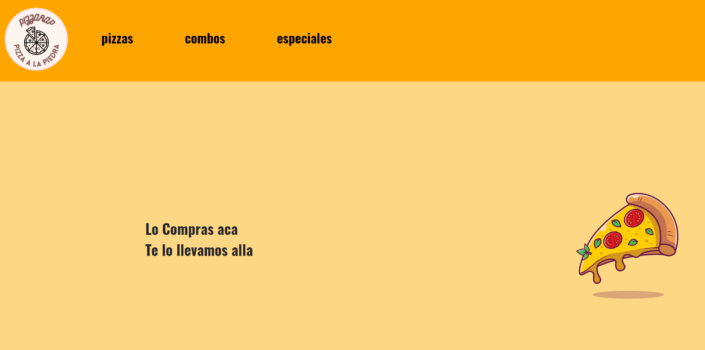

# Proyecto final REACT - PizzaRap E - Commerce

## Introduccion

PizzaRap es un e-commerce desarrollado con React. Se utilizaria para vender comida online, para clientes que la pueden pedir a domicilio y al mismo tiempo dejar los datos de cliente a disposicion de la empresa. Con su propia base de datos de productos, posiblidad de usar un carrito, saber la suma total de la cantidad y el precio de productos, y la solucitud del pedido enviada a la misma base de datos a traves de un formulario.

## Tecnologias usadas 

Firebase (^9.6.3): Software de desarrollo que ofrece varios servicios pero principalmente utilizado con firestore para proveer al e-commerce de una base de datos para los productos y pedidos.
SweetAlert2 (^11.3.10): Libreria sencilla para aportar ventanas emergentes de alerta y/o confirmacion

## Componentes

Apenas se carga el proyecto, se hace visible con los componentes de estructura y division (App establece los links y las rutas. NavBar lo hace visible en categorias). Luego, la accion mas interactiva de la compra sucede de a 3 componentes. Los productos visibles en las categorias y la eleccion de los productos (ItemListContainer, ItemList, Item. Respectivamente) luego tienen su segundo movimiento: elegir cantidad de unidades e ingreso al carrito(ItemDetailContainer, ItemDetail, ItemCount). Luego la compra del usuario se va haciendo visible en el carrito (Carrito) y marcado por su icono en el navbar (cartWidget). Cuando el usuario finaliza el flujo termina en el componente de pagos (Pago) donde el usuario agrega sus datos asi puede recibir su pedido a domicilio y abonar. 
Todo esto intervenido por el contexto (cartContext) que permite establecer la informacion de la compra en estados y mantener la informacion en constante cambio.

## Sobre mi

Este proyecto esta desarrollado por mi, Agustin Chagnier, dentro del marco del curso de React que otorga Coderhouse (2021).
a.chagnier@gmail.com

## Como se visualiza este proyecto?

En consola:

### 1.Clonar repositorio (https://github.com/Agustin-Chagnier/pizzarap-chagnier.git)

### 2.Ingresar a la direccion del proyecto

### 3.Instalar NodeJs

### 4.Inicializar el proyecto (npm start)
